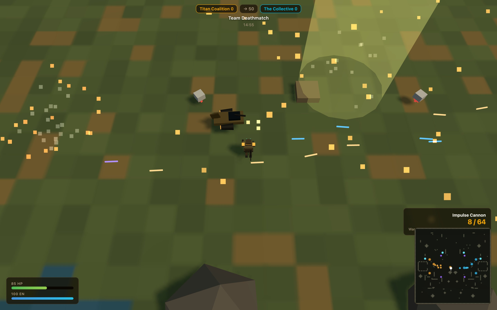
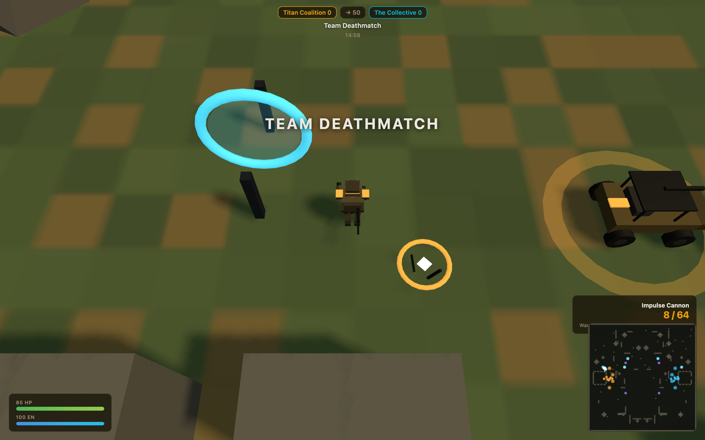
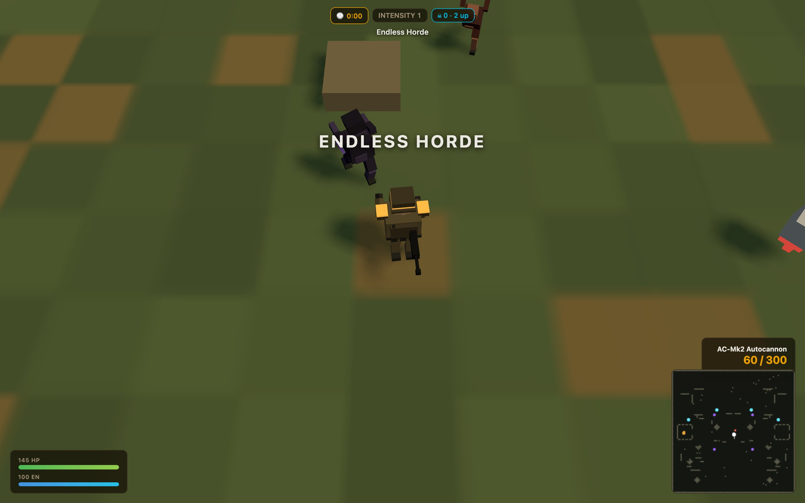
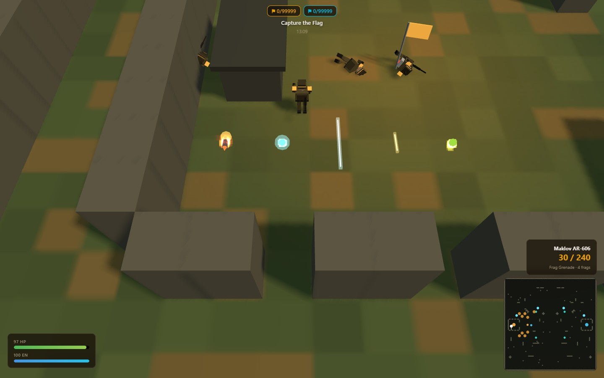
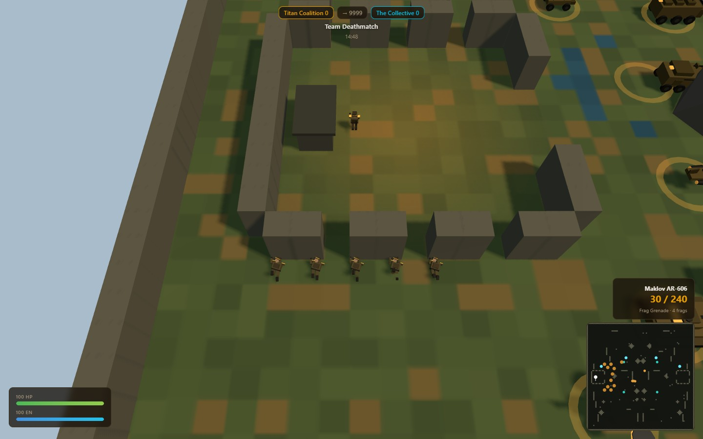
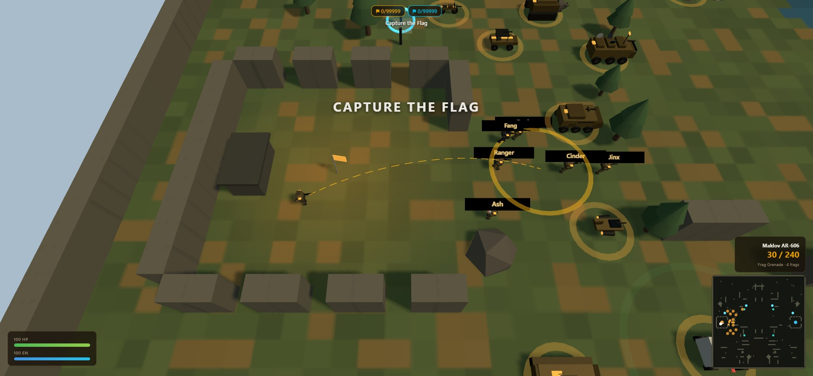
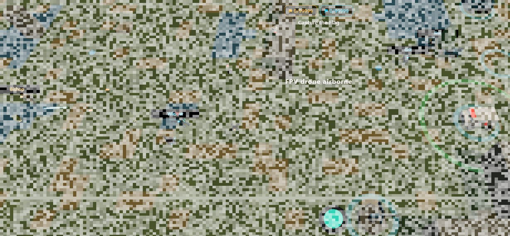

# ⚔️ War World: Earth

**A modern, browser-native reimagining of [Infantry Online](https://github.com/InfantryOnline/Infantry-Online-Server)** — the classic 1998 top-down multiplayer shooter — rebuilt from scratch in TypeScript + Three.js with a **200+ weapon armory**, **11 vehicles including multi-crew platforms with per-system damage**, seven game modes, eight combat classes, six battlefield environments, flyable **FPV recon drones**, comms channels with offline mail, Tribes-style warp tech, bots, and LAN multiplayer.

No install, no launcher, no plugins. `npm run dev`, open a browser, deploy.

      


*An orbital strike lands midfield — three seconds after the designator hits the dirt.*

## Fresh off the front

- 🛸 **Personal FPV drones** — as the Ghost, press Q and *fly* the drone yourself while your body kneels at the controller. Fly too far and static floods the feed until the link cuts and it tumbles out of the sky. EMP, gunfire, and a dead battery end the flight the same way.
- 🎯 **Cursor-targeted grenades** — hold G for the live flight arc and splash ring, release to land the frag exactly there. Verified accurate to 0.09 units.
- 🎬 **Cinematic killcam** — your final seconds replayed in slow motion with the camera pulled in tight on the fight.
- 💥 **Ragdoll deaths & distinct rounds** — bodies tip toward the killing blow and go limp; rockets, plasma, rail, slugs, and acid all read differently in flight.
- 🔊 **AI-generated sound pack** — 58 sounds with per-class death cries, rifle and zombie-growl round-robin variety, and an in-browser [Sound Lab](#sounds) to rate and replace any of them.
- 🧭 **Where it's all going:** the [Design Directive](docs/DESIGN-DIRECTIVE.md) — factions, a living campaign, service records, and command with teeth.

## Screenshots

All captured from live matches (regenerate any time with `node tools/capture-screenshots.mjs`).

| | |
|:--:|:--:|
| <br>**Deployment** — 7 modes, 8 classes, match setup | <br>**Capture the Flag** — tracers both ways, 10 HP left |
| <br>**Ares Battle Tank** — 650 armor, 120mm cannon | <br>**Jump gate + warp beacon** — Tribes-style teleport tech |
| <br>**Zombie Survival** — squad holds a bunker gate | <br>**Phase Stalker** — blinks through walls at you |
| <br>**Conquest** — sentry fortifying point B | <br>**Scoreboard** — kills, deaths, score by team |
| <br>**Distinct rounds** — rocket, plasma, rail, slug, acid all read differently | <br>**Ragdoll deaths** — bodies tip and go limp toward the killing blow |
| <br>**Cursor-targeted throws** — hold G for the arc, release to land it on the ring | <br>**FPV drone at the edge of its range** — fly it too far and the feed dies in static |

## Quick start

```bash
npm install
npm run dev          # → http://localhost:3400 — play vs bots offline
```

**Multiplayer (LAN):**

```bash
npm run server       # dedicated server on ws://0.0.0.0:3401
```

Then enter `ws://<host-ip>:3401` in the Multiplayer field on the menu. One room per game mode, bots fill empty slots, matches auto-restart. Leave the field blank to play offline against bots.

**Everything else:**

```bash
npm run build        # typecheck + production bundle → dist/
npm test             # 176 sim tests (combat, modes, vehicles, arsenal balance, ranges, drones, visuals, netcode)
npm run sounds       # regenerate the CC0 synth sound pack from source
npm run map:import:sf # rebuild the frozen Potrero/Dogpatch real-city theater
```

Dev extras while `npm run dev` is up: the **[model & physics harness](docs/HARNESS.md)** at `/harness.html` and the **Sound Lab & Review** at `/sound-review.html`.

### Real-city pilot

The `geocity` theater is a 900×900-unit Potrero Hill / Dogpatch battlefield compiled from real street and building geometry plus USGS elevation. It runs through the ordinary `GameMap`, renderer, vehicle, AI, and Map Maker paths; selected source parcels receive native enterable procedural interiors. Matches never contact a map service—the checked-in artifact is the runtime input.

The import command reuses the artifact's frozen source snapshot for deterministic rebuilds. Remove or relocate the output first only when intentionally refreshing source data, then review the resulting attribution, validation report, and diff. Architecture, limits, and licensing notes are in **[docs/GEOSPATIAL-MAPS.md](docs/GEOSPATIAL-MAPS.md)**.

## Controls

| Input | Action |
|---|---|
| WASD | Move (drive/steer in vehicles · **fly your FPV drone** while linked) |
| Mouse | Aim · left-click fire · **wheel zooms the camera** |
| Space | Jetpack (Jump Trooper) / hop |
| E | Enter/exit vehicle · use warp beacon · escort Dr. Voss |
| Q | Class ability (cloak, sentry, warp beacons, shield dome · **Ghost: deploy/cut the FPV drone**) |
| G *(hold)* | **Aim a throw — arc + landing ring at your cursor — release to send it** (frag · Engineer: mine · Pathfinder: targeting beacon · Ghost: EMP · orbital designator if held) |
| M | Toggle the large tactical minimap |
| R | Reload · 1-3 weapon slots · TAB scoreboard |

## Game modes

| Mode | Rules |
|---|---|
| 💀 **Team Deathmatch** | First team to 50 kills |
| 🚩 **Capture the Flag** | Steal the enemy flag while yours is home — first to 3 caps |
| ⛰️ **King of the Hill** | Hold the center hill for 120 accumulated seconds |
| 🎯 **Conquest** | Hold control points A/B/C to drain tickets — first to 500 |
| 🧟 **Zombie Survival** | Co-op vs escalating waves (specials mix in from wave 2) |
| 🩸 **Endless Horde** | No waves, no breaks — continuous spawning that ramps every 30s until the squad falls |
| 🧪 **Protect the Scientist** | A suburban neighborhood map. The horde searches house to house for Dr. Voss — hide him (E to escort/relocate), defend when they find him, survive the 5-minute evac countdown |

## Classes

| Class | HP | Loadout | Ability |
|---|---|---|---|
| Infantry | 100 | Maklov AR-606 + P9 | 4 frag grenades |
| Heavy Weapons | 145 | AC-Mk2 Autocannon + Micro-Missiles | Slow but devastating |
| Jump Trooper | 90 | Kuchler K6 SMG + GL-40 | Jetpack (energy-fueled) |
| Combat Engineer | 110 | CAW-8 Shotgun + Repair Gun | Builds sentry turrets, plants mines |
| Field Medic | 100 | K6 SMG + Medi-Beam | Heals squad, self-stim |
| Infiltrator | 80 | RG-2 Railgun + P9 | Cloaking field |
| Pathfinder | 85 | Impulse Cannon (knockback) + P9 | **Warp beacon pair** (Q), targeting beacons (G), fastest on foot |
| Ghost | 90 | Kamenel Plasma + P9 | **FPV drone** (Q) — you fly it, it spots for the team; EMP charges (G) |

Plus battlefield pickups: medkits, ammo crates, energy cells, the F-3 Flamer, and **orbital strike designators**.

## Field tech (the Tribes homage)

- **Warp Beacons** — Pathfinders plant an ALPHA/BETA pair; any teammate presses E on one to teleport to the other. Beacons are destroyable (150 HP).
- **Jump Gates** — paired glowing arches on battlefield maps; walk in, come out the other side (4s cooldown).
- **Grav-Lifts** — step on a pad, get flung ballistically toward midfield.
- **Targeting Beacon** — lobbed; pings every enemy within 25 units onto your minimap for 15s (cloaks included).
- **Orbital Strike** — pickup-only designator: throw it, 3 seconds of klaxon, then a beam annihilates the area. The beacon can be shot before it fires.
- **Shield Dome** — Heavy's deployable bubble (400 HP, 30s) that eats enemy projectiles.
- **FPV Recon Drone** — the Ghost flies it in first person while their body kneels defenseless. ~55-unit control range: the further it flies, the more static drowns the feed, until the link cuts and the drone tumbles out of the sky. EMP jams it; bullets wing it.
- **EMP Charge** — Ghost's lobbed charge: stalls vehicles 4s, blinds turrets 5s, strips cloak and energy — and knocks enemy drones out of the air.
- **Supply Pods** — every 90s a pod screams down from orbit with one-shot loot, sometimes an orbital designator.
- **Phase Stalker** — the undead answer to all of it: a rare zombie that blinks through walls toward prey.

## The Armory — 200+ weapons

Sixteen families — lasers, pistols, rifles, carbines, SMGs, slug throwers,
shotguns, scatter packs, LMGs/HMGs, AT & AP rockets, mortars, field-gun
artillery, sonic cannons, flamethrowers, and frag/**smoke**/**phosphorus**
grenade launchers — across four manufacturers and three marks, all
hand-balanced and test-enforced. Pick yours in the menu's **Armory**; bots
draw from the same racks. Full catalog: **[docs/ARSENAL.md](docs/ARSENAL.md)**.

## Vehicles

| Vehicle | Armor | Seats | Role |
|---|---|---|---|
| Scout Buggy | 220 | 2 | Fast harassment, mounted MG |
| Ares Battle Tank | 650 | 8 | 120mm cannon · sensors/ECM/comms crew stations · 4 passenger benches |
| Bastion APC | 450 | 4 | **Mobile spawn point** (while its comms live) |
| Wraith Skiff | 160 | 1 | Hover — crosses water, plasma repeater |
| Jackal Recon Bike | 130 | 1 | Fastest wheels in the war, light MG |
| Halo Hoverboard | 70 | 1 | Personal hover deck — unarmed, absurd |
| Kestrel Gunship | 200 | 2 | **Flies over walls**, plasma battery |
| Atlas Transport | 520 | 9 | Gunner/sensors/ECM/comms stations + 4 passengers, mobile spawn |
| Mercy Field Ambulance | 300 | 3 | Heals every friendly around it |
| Mole Tunneling Machine | 700 | 2 | **Grinds walls into open ground** |
| Bulwark Emplacement | 380 | 1 | Static manned artillery at each midfield |

Every vehicle carries five damageable subsystems — **engine, weapon, sensors,
ECM, comms** — each with its own hit points and its own failure mode: engines
limp, guns jam, sensors go dark, ECM-dead vehicles glow on enemy radar,
comms-dead transports stop spawning reinforcements. Man the stations: a
crewed sensor seat is a rolling radar; a crewed ECM seat jams enemy pings.
Vehicles spawn on team pads and respawn 22s after destruction. Engineers
(and the Mechanic Kit) repair them.

## Comms, equipment & advanced line of sight

- **Comms** — Enter to chat, custom channels (`/join`), Tab to cycle, F1–F8
  macros, and `/msg <player>` **stores mail delivered next time they deploy**.
- **Equipment** — pick two at deploy: ballistic vest, power armor, stealth
  suit, IR/UV goggles, mine detector, mechanic kit, combat medikit, head cam
  network, tactical waypoints, psi scanner, demolition kit, hacking kit, spy
  camera.
- **Advanced LOS** — the minimap is fog-of-war: you see what you (and, with a
  head cam network, your teammates) actually see, plus beacon/drone/camera/
  sensor-crew/psi pings. Smoke blinds it; ECM crews jam it.

## Environments — the war scales the solar system

Terra savanna · **starship boarding corridors** · a **hollowed asteroid** ·
the **ocean floor of Europa** (9 m/s² — jumps float) · **Titan's methane
haze** · **Triton's nitrogen ice**. Each is a distinct generator mix, palette,
fog, and gravity; the dedicated server rotates them per match.

## Coming soon

Everything above is built and playable today. These are **planned, not shipped** — roughly in the order they'd land:

#### 📱 Phone play
The game already loads and renders on any phone browser — the gap is input. Virtual twin-stick touch controls (left thumb moves, right thumb aims and fires, tap-buttons for E/Q/G/R) plug straight into the existing command struct without touching the simulation. Plus a mobile quality tier and a PWA manifest so "Add to Home Screen" gives a full-screen, icon-launched game. **No app store, ever.** See the [mobile assessment](docs/MOBILE-FEASIBILITY.md) for the full breakdown.

#### 🌐 Play from anywhere
The dedicated server is a plain WebSocket. Fronting it with a tunnel (`wss://`) and serving the static build turns LAN play into internet play — no port forwarding, no launcher.

#### 🧠 Smarter squads
From the [AI report's](docs/AI-REPORT.md) own to-do list: dedicated defenders vs. runners in CTF, sound-event memory ("shots behind me" → investigate), utility scoring to replace the if/else objective chain, and bot chatter in the killfeed.

#### 🗺️ More battlefield
Hand-authorable maps alongside the seeded generator, a proper map editor, and new vehicles (dropship insertions, a walker).

#### 📈 Persistence
Match history, per-class stats, and a personal shipping log of your best games — currently everything evaporates when the match ends.

Have an idea? The sim is one folder of plain TypeScript with no engine lock-in — new weapons and modes are usually a single table entry plus a rules function.

## Docs

- **[Design Directive](docs/DESIGN-DIRECTIVE.md)** — where the game is going: factions, the living war, command, blast physics, the Prototype Program
- **[Field Manual](docs/MANUAL.md)** — how to play, HUD guide, class doctrine, vehicle guide, field tips (with live screenshots)
- **[The Arsenal](docs/ARSENAL.md)** — all 200+ weapons, 11 vehicles, crew stations, equipment, comms, LOS, environments
- **[AI Report](docs/AI-REPORT.md)** — how the bots perceive, path, fight, drive, and swarm
- **[Mobile Feasibility](docs/MOBILE-FEASIBILITY.md)** — runs in a phone browser today; what touch controls would take
- **[Model Harness](docs/HARNESS.md)** — a dev inspector for every procedural model, the physics, and combat (`/harness.html` in `npm run dev`)
- Screenshots regenerate with `node tools/capture-screenshots.mjs` while the dev server runs

## Architecture

```
src/
  sim/        deterministic simulation — zero DOM/Three imports, runs anywhere
    world.ts    entities, physics, combat, damage, vehicles, turrets, mines
    modes.ts    the seven game-mode rulesets
    bots.ts     BFS pathfinding + combat AI + zombie hordes
    map.ts      seeded symmetric map generator (same seed ⇒ same map)
    snapshot.ts wire codec (server-authoritative full snapshots)
  client/     Three.js renderer, particles, positional audio, HUD, input, netcode
  server/     dedicated WebSocket server (rooms, bots, auto-restart)
tools/        procedural sound-pack generator
tests/        vitest suite over the sim
```

The sim is deterministic and shared verbatim by the offline game, the client's dead-reckoning, and the dedicated server — the classic "server-authoritative with client extrapolation" model, at 30Hz ticks / 15Hz snapshots.

## Sounds

The game ships **58 sound effects** — one per event, per-class death cries, and round-robin variety for rifle shots and zombie growls. Two interchangeable packs feed the same slots:

- **ElevenLabs pack (shipped):** generated via ElevenLabs text-to-sound-effects — one tuned prompt per sound in [`tools/sound-specs.mjs`](tools/sound-specs.mjs), rendered by [`tools/gen-sounds-ai.mjs`](tools/gen-sounds-ai.mjs). Licensed under ElevenLabs' terms — **not CC0** (see [public/audio/LICENSE.txt](public/audio/LICENSE.txt)).
- **CC0 synth pack:** `npm run sounds` ([`tools/gen-sounds.mjs`](tools/gen-sounds.mjs)) regenerates a fully procedural, public-domain (CC0 1.0) pack — no samples, no external services — overwriting the directory. See [public/audio/LICENSE-CC0.txt](public/audio/LICENSE-CC0.txt).

Audition, rate (👍/👎), tune, and replace any sound in the **Sound Lab & Review** (`/sound-review.html`, linked from the model harness).

## Lineage

War World is an original homage to *Infantry Online* (Sony Online Entertainment, 1998), whose community keeps the original alive at [InfantryOnline/Infantry-Online-Server](https://github.com/InfantryOnline/Infantry-Online-Server). The class archetypes (Jump Trooper, Combat Engineer, Infiltrator…), weapon naming style (Maklov, Kuchler, Kamenel, RG-2, AC-Mk2, CAW), vehicle categories, and mode list (CTF, KOTH, Conquest, Zombie) all trace back to the original's design. No code or assets from the original are used.

## License

MIT — see [LICENSE](LICENSE). Audio licensing is per-pack — see [Sounds](#sounds).
