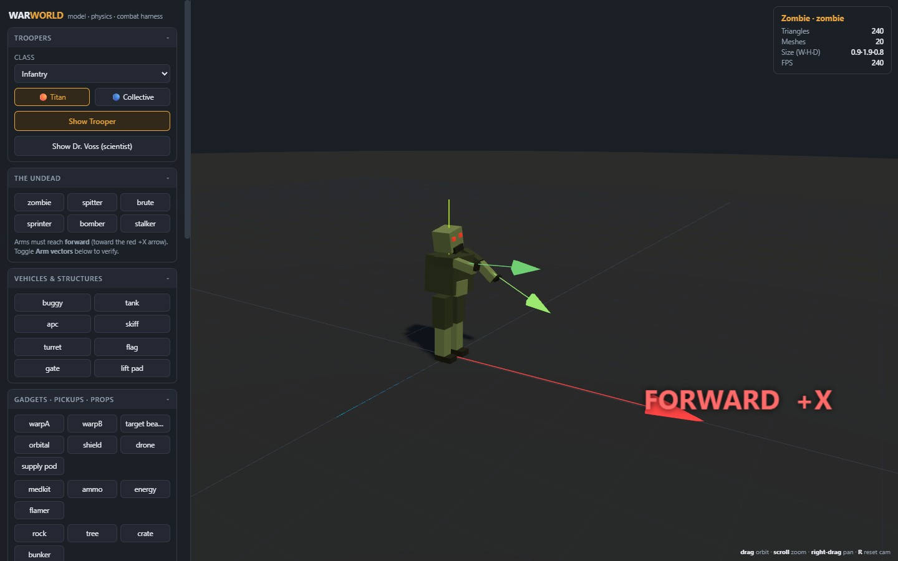
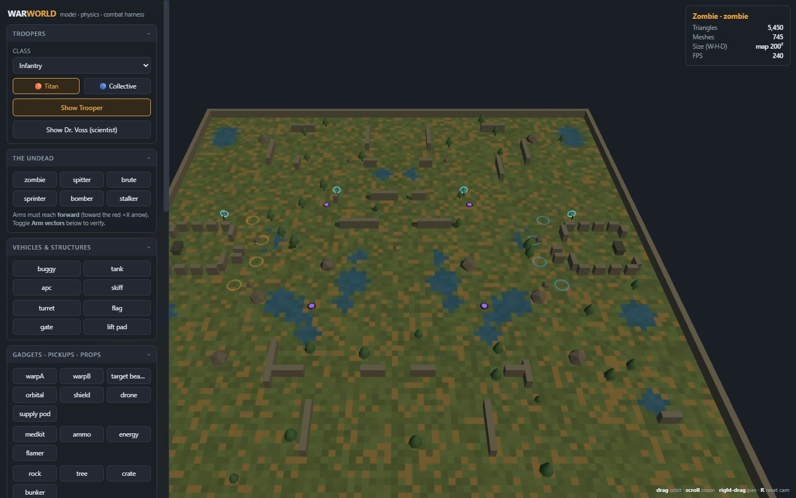

# 🔧 Model · Physics · Combat Harness

A standalone Three.js inspector for **War World**'s procedural models and
environments. It renders every `build*` model from
[`src/client/models.ts`](../src/client/models.ts) in isolation, under the same
lights the game uses, so you can diagnose a model's geometry, pose, physics, and
combat behaviour without spinning up a whole match.

> The harness exists to *improve the app*: it's how the zombie arms were caught
> reaching backwards, and how the leftover **purple** grav-lift / phase-stalker
> colours were spotted and removed.

## Open it

```bash
npm run dev          # → http://localhost:3400/harness.html
```

It ships as a second page in the Vite build too (`npm run build` emits
`dist/harness.html`). It is a **dev tool** — there's a small `🔧 harness` link
in the bottom corner of the game's main menu; players never need it.

## Camera

`drag` orbit · `scroll` zoom · `right-drag` pan · **R** reset camera.

## What it does

| Panel | Use |
|---|---|
| **Troopers** | Every class × team, plus Dr. Voss (the scientist). |
| **The Undead** | All six zed kinds — zombie, spitter, brute, sprinter, bomber, stalker. |
| **Vehicles & Structures** | The full 11-vehicle motor pool — buggy, tank, APC, skiff, hoverboard, bike, flyer, transport, ambulance, tunneler, emplacement — plus sentry turret, flag, jump gate, grav-lift pad. |
| **Gadgets · Pickups · Props** | Warp beacons, orbital designator, shield, drone, supply pod; medkit/ammo/energy/flamer; rock/tree/crate/bunker. |
| **Inspect** | Ground grid, world axes + **FORWARD (+X)** arrow, wireframe, bounding box, joint markers, **arm forward-vectors**, turntable. |
| **Animation** | Play the shared gait/reach ([`src/client/animation.ts`](../src/client/animation.ts)) at any move speed; jetpack-tuck (airborne) toggle. |
| **Physics sandbox** | Drop test, hop, jetpack burst — integrated at the sim's own constants (gravity 22, hop 7, jet 9.5). Fire a projectile with any weapon's real speed/arc and watch the ballistic trail. |
| **Combat sandbox** | Drop a target dummy at a chosen range and fire any weapon; the tracer leaves the shooter's muzzle line and a floating damage number appears — a quick check of muzzle offset & facing. |
| **Environment** | Build any real generated map (all seven modes, any seed) into the scene and orbit it to inspect walls, cover, ponds, props, gates and lift pads. |
| **Map Maker** | The AAA editor: any of the ten fronts × three tiers (or a blank canvas) as a 2D top-down document. Paint the full terrain alphabet + surfaces, place props/buildings/objectives, drag objectives around, stamp & delete buildings atomically. The six front laws run **live** (sealed rim, zero orphans, readable, enterable, indoors, walls) — a green badge means the suite would pass. 40-deep undo, autosave, JSON download/copy/import, and one-click 3D preview of the map you're editing. Engine: [`src/sim/mapedit.ts`](../src/sim/mapedit.ts) — pure sim, test-covered in `tests/mapedit.test.ts`. |

## The "arms face forward" convention

The soldier root faces **+X** (yaw 0) and every limb hangs **down** from its
joint. Rotating a limb about **+Z** by a **positive** angle swings its far end
toward **+X — forward**, out in front of the body. This is why
[`zombieArmRest`](../src/client/animation.ts) returns positive angles: the
undead must *reach at you*, not flail behind themselves.

Toggle **Arm forward-vectors** in the Inspect panel: each arm draws a green
arrow in the direction it actually points. For a correct reach those arrows
line up with the red **FORWARD +X** arrow. There's also a live check:

```js
// in the browser console on /harness.html
window.__h.armDirs()
// → { armL: { x: 0.99.., forward: true }, armR: { x: 0.9.., forward: true } }
```

`forward` must be `true` (arm's X component > 0) for both arms.




