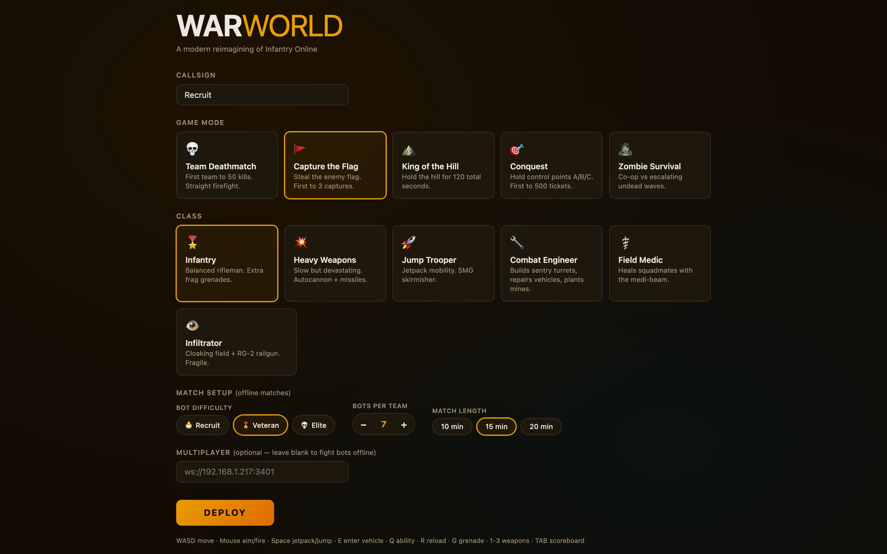
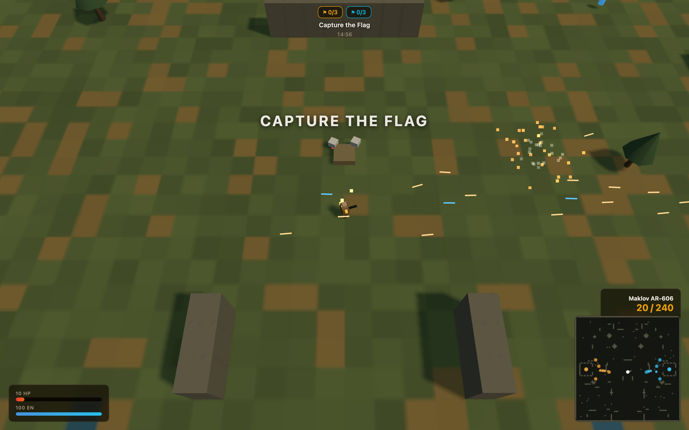
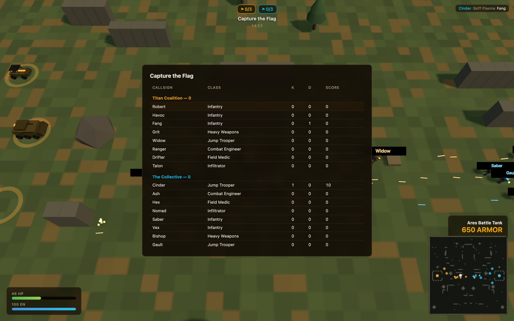
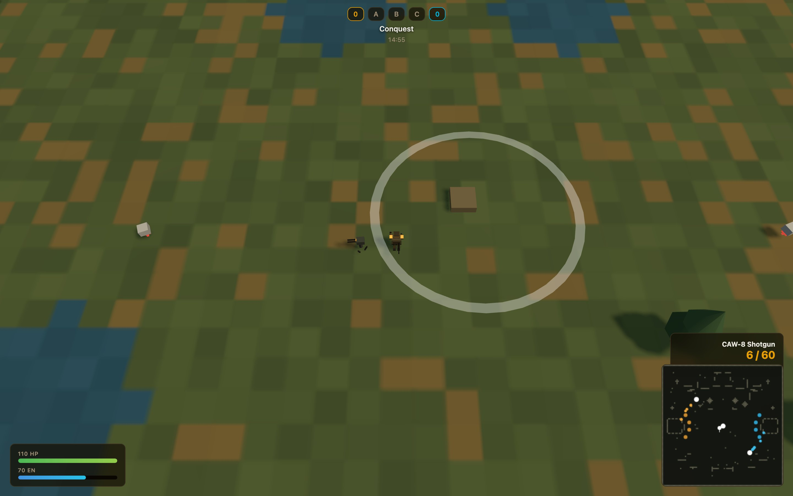
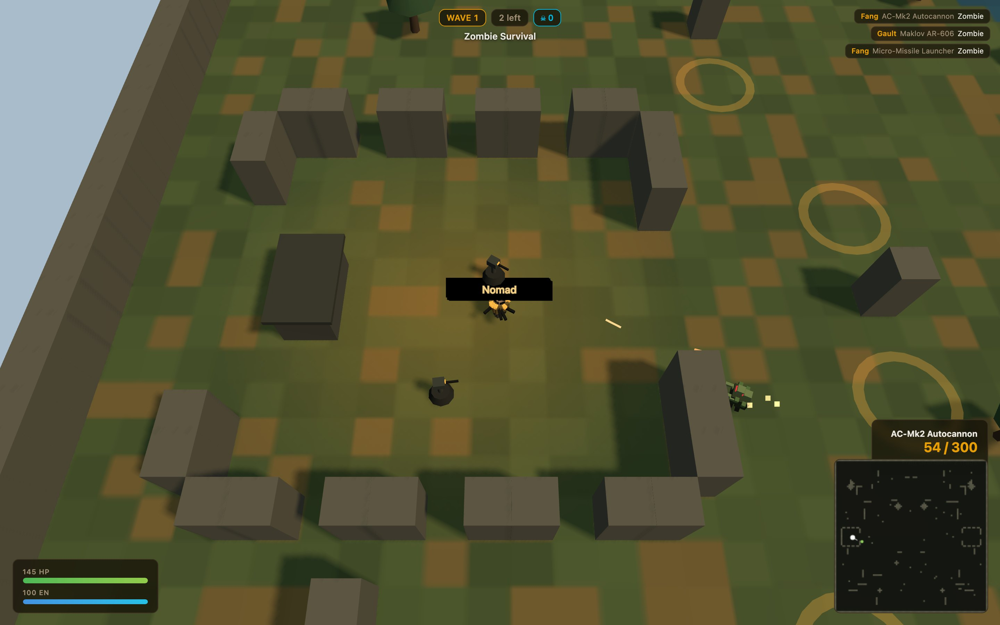
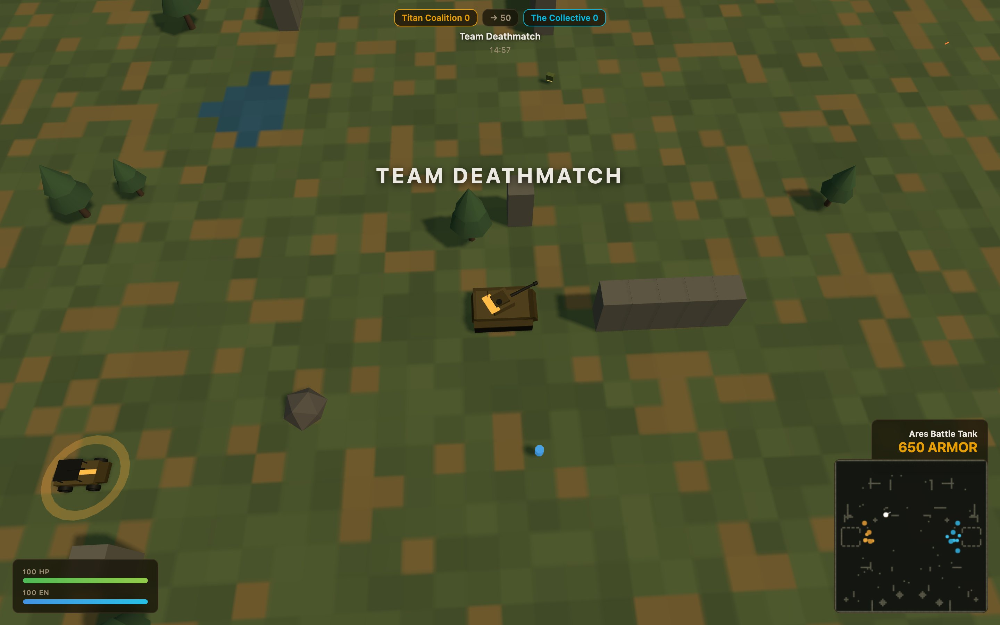

# War World — Field Manual

*Based on live combat footage captured 2026-07-10. Screenshots in [docs/screenshots/](screenshots/).*

---

## 1. Deployment

Open the game (`npm run dev` → http://localhost:3400) and you land at the deployment screen:

1. **Callsign** — your name in the killfeed and scoreboard.
2. **Game Mode** — pick one of five (details in §4).
3. **Class** — your loadout and ability (details in §5).
4. **Match Setup** — offline matches only:
   - **Bot difficulty** — 🐣 Recruit (bots miss a lot) · 🎖️ Veteran (fair fight) · 💀 Elite (they barely miss).
   - **Bots per team** — 0–12 a side. Zero bots = an empty range to practice in.
   - **Match length** — 10 / 15 / 20 minutes.
5. **Multiplayer** — paste a server address (e.g. `ws://192.168.1.217:3401`) to play online; leave blank to fight bots offline.
6. Hit **DEPLOY**.

## 2. Controls

| Input | Action |
|---|---|
| **W A S D** | Move. In a vehicle: W/S = throttle, A/D = steer |
| **Mouse** | Aim — your soldier (or turret) tracks the cursor |
| **Left click** | Fire |
| **Space** | Jetpack (Jump Trooper) — everyone else gets a small hop |
| **E** | Enter / exit a vehicle (prompt appears when close) |
| **Q** | Class ability — cloak, sentry, self-stim |
| **G** | Throw frag grenade (Engineer: plant a mine) |
| **R** | Reload |
| **1 / 2 / 3** | Weapon slots (3 = F-3 Flamer if you picked one up) |
| **TAB** | Hold for scoreboard |

## 3. Reading your HUD

- **Top center** — objective chips (flag counts, hill timer, tickets, wave number) + match clock.
- **Bottom left** — HP (green) and Energy (blue). Energy feeds jetpack, cloak, and abilities. The HP bar turns red when you're low — in the shot above the player is at 10 HP under fire. Break line of sight and find a medkit.
- **Bottom right** — current weapon, `clip / reserve` ammo, ability hint, and the **minimap**: amber = your team, cyan = enemy, green = zombies, white = you, large dots = vehicles.
- **Top right** — killfeed: who killed whom, with what.
- **✕ hitmarker** flashes at your crosshair when your shots connect.

When you die you'll see **K.I.A.** and a respawn countdown (~4s). If your team has a crewed Bastion APC in the field, you may respawn at it — right on the front line.

Hold **TAB** for kills / deaths / score by team. Score counts kills, flag caps, returns, heals, vehicle kills.

## 4. The five modes

| Mode | How to win | Field notes |
|---|---|---|
| 💀 TDM | First team to 50 kills | Pure aim. Stay near cover lanes mid-map. |
| 🚩 CTF | 3 captures | You can only score while **your own flag is home**. Killing a carrier drops the flag; defenders touch it to return it. Carriers can ride vehicles. |
| ⛰️ KOTH | Hold the hill 120s total | Contested hill (both teams inside) pauses the clock. |
| 🎯 Conquest | 500 tickets | Stand inside A/B/C rings to capture. More points = faster tickets. B (center) is the bloodbath — engineers should fortify it. |
| 🧟 Survival | Outlast waves | Co-op. Wave *n* has 6+3n zombies that get tougher. Specials mix in from wave 2. Ends when the whole squad is down. |
| 🩸 Endless Horde | Survive as long as you can | Co-op, no wave breaks — spawning is continuous and the **intensity ramps every 30 seconds** (population and spawn rate keep climbing). Score = squad kills + time survived. |

### Know the undead

| Zombie | HP | Threat |
|---|---|---|
| Shambler | 60 | The mass. Slow, relentless, arrives in crowds. |
| Spitter | 45 | Ranged acid lobber — kites away when you close in. Kill first. |
| Brute | 320 | Walking wall. Feed it autocannon or railgun, not SMG fire. |
| **Sprinter** *(rare)* | 40 | Nearly twice your run speed. By the time you hear about it, it's on you — hip-fire immediately. |
| **Bomber** | 90 | Bloated, glowing belly. Charges to point-blank and **detonates** — and it still explodes when killed, so drop it at range. |

*Holding point B with a sentry turret placed on the ring. The white ring turns your team's color when captured.*

*Wave 1 holdout — squad backs into a bunker, autocannon covering the gate.*

## 5. Classes in the field

- **Infantry** — the baseline. AR-606 wins most mid-range duels; you carry 4 frags. When in doubt, pick this.
- **Heavy Weapons** — 145 HP but slow. Autocannon shreds vehicles and Brutes; swap to Micro-Missiles (2) for clusters. Stay behind the front, not in it.
- **Jump Trooper** — Space to fly over walls and low cover. The GL-40 lets you lob grenades while airborne. Energy is your lifeline — land before it empties.
- **Combat Engineer** — Q drops a sentry (80 energy, max 2). Put them on flag stands and control points. G plants proximity mines (vehicle killers — 220 damage). The repair gun fixes vehicles, turrets, and APCs mid-fight.
- **Field Medic** — Beam heals allies through walls of gunfire; you score 2 points per heal tick. Q is a 45 HP self-stim. Shadow your Heavy.
- **Infiltrator** — Q cloaks you (invisible to enemies beyond 9 units, turrets ignore you). Firing decloaks. Rail a target, cloak, relocate. 80 HP: never trade shots openly.

## 6. Vehicles

*The Ares Battle Tank at full 650 armor. The HUD swaps to vehicle mode showing armor instead of ammo.*

Walk up to a vehicle on your team's pads (glowing rings by your base) and press **E**.

- **Scout Buggy** (220) — fastest wheels + MG. Flag runs and harassment.
- **Ares Battle Tank** (650) — the 120mm cannon one-shots infantry in its blast. Slow turret, weak to mines and massed missiles.
- **Bastion APC** (450) — seats 4 and acts as a **mobile spawn** for your team. Park it behind the objective, not on it.
- **Wraith Skiff** (160) — hovercraft: it crosses **water** nobody else can. Plasma repeater. Made of paper — keep moving.

Destroyed vehicles hurt everyone inside and respawn on their pad ~22s later. Engineers repair them; mines delete them.

## 7. Field tips

1. Cloaked Infiltrators still show a shimmer to their own team — watch for enemy shimmer up close (within ~9 units they're visible).
2. Grenades arc **over** low cover; bullets don't. Use G on dug-in engineers.
3. The ammo crate pickup refills every weapon; energy cells also top up a grenade.
4. In Survival, back into a bunker so the horde funnels; a medic + heavy pair is nearly immortal if the medic lives.
5. Tanks can't shoot what's touching their hull — jetpack onto them and unload.
6. Watch the minimap for the white flash of your flag leaving base — returns win CTF games.
7. Elite bots lead their shots. Strafe-switch direction mid-fight, don't run straight lines.

## 8. Multiplayer

Start a dedicated server (`npm run server`, default port 3401). Every player on the LAN enters `ws://<server-ip>:3401` and picks the same mode to share a room. Bots fill empty slots and matches restart automatically ~12s after they end.
